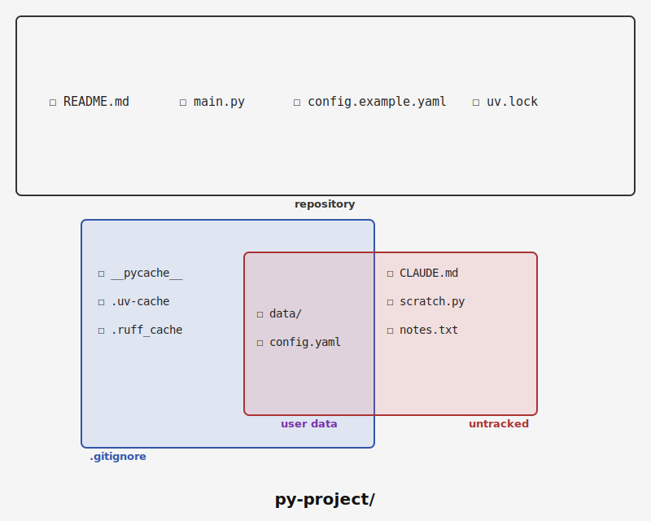

# Contributing

The most useful contributions to **dil** are better litter rules.

## Rule Contributions

**dil** builds its rule set from three sources:

1. [Kondo](https://github.com/tbillington/kondo)'s Rust project artifact definitions: [kondo-lib/src/lib.rs](https://github.com/tbillington/kondo/blob/master/kondo-lib/src/lib.rs)
2. [Tokei](https://github.com/XAMPPRocky/tokei)'s language detector metadata: [languages.json](https://github.com/XAMPPRocky/tokei/blob/master/languages.json)
3. [dil's `dil.toml`](./dil.toml), which resolves the mapping of the above and extends local policy: [dil.toml](./dil.toml)

That means the biggest gap is ecosystem familiarity. Python, Node, React, LaTeX, and the other currently covered types reflect the environments I can comfortably work in. If you work in another language, framework, or build tool, the most useful contribution is a `dil.toml` refinement for that ecosystem. Start by looking at [dil/rules.toml](./dil/rules.toml): there are still common stacks missing from the generated rule set. A good contribution proves:

- what is truly disposable
- what only looks disposable but is user-authored or environment-specific
- which sentinel should activate the type
- which detector is too weak and causes false positives



Good rule contributions should include a reduced dummy fixture modeled on a real project tree. See [test/README.md](./test/README.md) for the fixture format, harness behavior, and test workflow.

Run the full test suite with `uv run pytest`.

## Project-Local Policy

A framework or application repo can ship its own `dil.toml` to declare what is disposable for that project without teaching `dil` that a broad ignored subtree is removable.

For example, [Go](https://github.com/golang/go) is still missing from the generated rule set. It's not in Kondo as of March 2026 and I am not experienced in Go.  From what I've researched, a Go service could ship a local `dil.toml` like this:

```toml
[type.go]
priority = 0

[type.go.add]
dirs = ["bin"]
files = ["coverage.out"]
paths = [
  "data/cache/**",
  "data/tmp/**",
]
detect_suffix = [".go"]
```

That does three useful things:

- activates the type when Go source is present
- declares obvious build litter like `bin/` and `coverage.out`
- keeps `data/` itself protected while only targeting the known waste inside it

## Override Order

1. built-in generated rules
2. `~/.config/dil/config.toml`
3. project-local `dil.toml`

That lets a project narrow or extend the global defaults for its own tree before `dil` lists or deletes matches.
